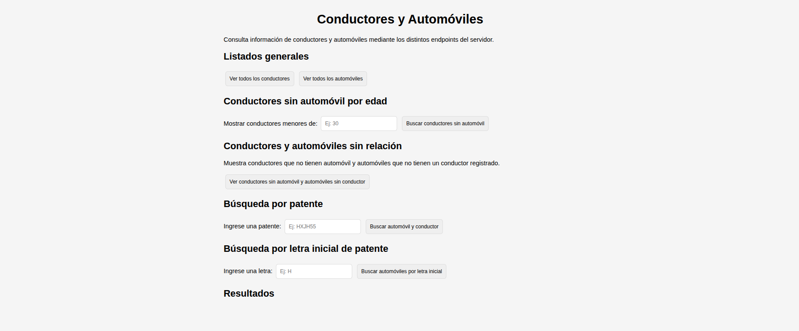
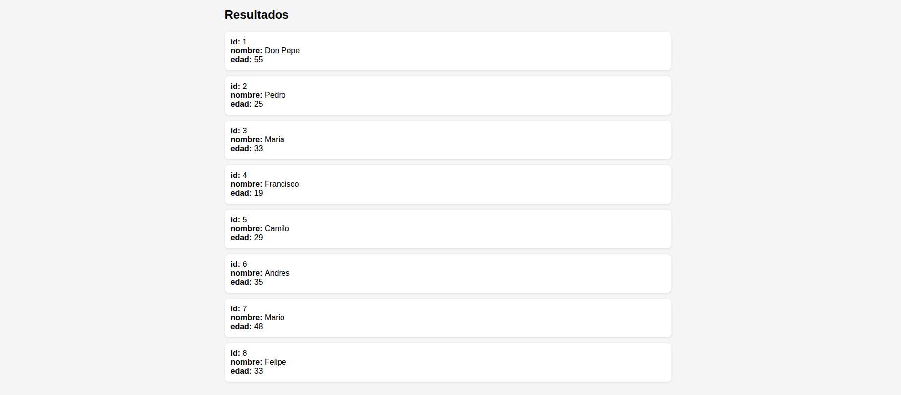
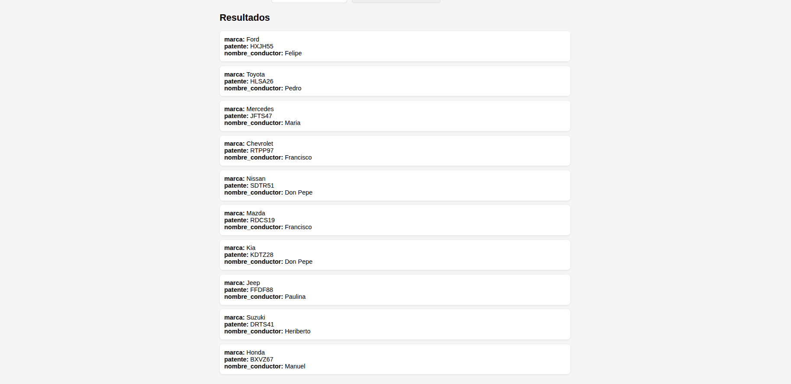
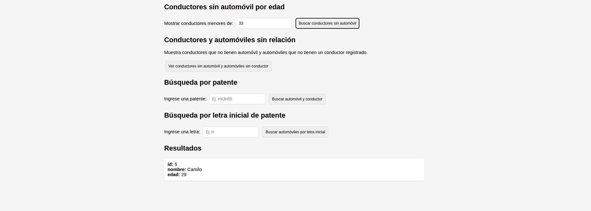
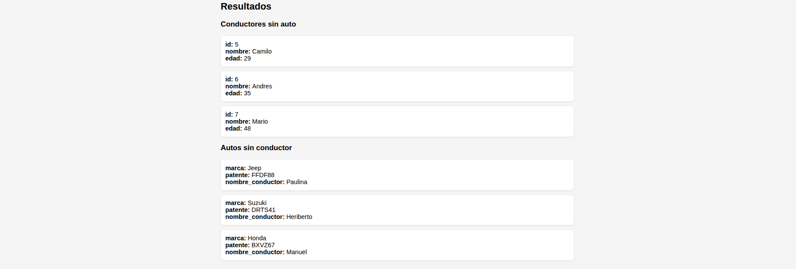

# Sistema Conductores & Automóviles

## ¿De qué trata el proyecto?

Este proyecto es una aplicación web que administra un registro de **conductores** y **automóviles**. Cuenta con un backend (servidor Node/Express) que expone distintos endpoints tipo `GET` para consultar la información (conductores sin auto, autos sin conductor, búsqueda por patente, etc.), y un frontend que consume esos endpoints y muestra los resultados de forma ordenada (listas, tarjetas o tablas). Cada consulta se activa desde un **botón** en la interfaz.

---

## Funcionalidades (capturas de cada botón)

A continuación se muestra la data del endopint que va a buscar la info , junto con su botón correspondiente en el frontend y una captura de lo que retorna

---

## Captura del Front End

Aquí vemos cada botón e inputs necesarios para probar los endpoints que devuelve todo o los que devuelven según la condición que pida el input



---

### 1. `GET /conductores`

Retorna la lista de todos los conductores.

**[ 🔘 Botón: Ver todos los conductores ]**



---

### 2. `GET /automoviles`

Retorna la lista de todos los automóviles.

**[ 🔘 Botón: Ver todos los automóviles ]**



---

### 3. `GET /conductoressinauto?edad=<numero>`

Retorna los conductores menores de `<numero>` años que no tienen automóvil.

**[ 🔘 Botón: Buscar conductores sin auto por edad ]**



---

### 4. `GET /solitos`

Retorna la lista de conductores sin automóvil y automóviles sin conductor.

**[ 🔘 Botón: Ver "solitos" (conductores y autos sin pareja) ]**



---

### 5. `GET /auto?patente=<string>`

Retorna el automóvil con patente `<string>` y los datos de su conductor (si existe).

**[ 🔘 Botón: Buscar auto por patente exacta ]**


---

### 6. `GET /auto?iniciopatente=<letra>`

Retorna los automóviles cuya patente comienza con `<letra>` y los datos de su conductor (si existe).

**[ 🔘 Botón: Buscar autos por inicio de patente ]**


---

## Instalación

1. **Clonar el repositorio**:
   ```bash
   git clone [github proyecto]('https://github.com/luisaromero/ACTIVIDAD-API-CON-EXPRESS.git')
   cd proyecto
   ```
2. **Instalar dependencias**:
   ```bash
   npm install
   ```
3. **Crear tu archivo `.env`** en la raíz del proyecto (no viene en GitHub porque está en `.gitignore`):
   ```
   PORT=3000
   ```
4. **Levantar el servidor**:
   ```bash
   npm start
   ```
5. **Abrir el navegador** en:
   ```
   http://localhost:3000
   ```
